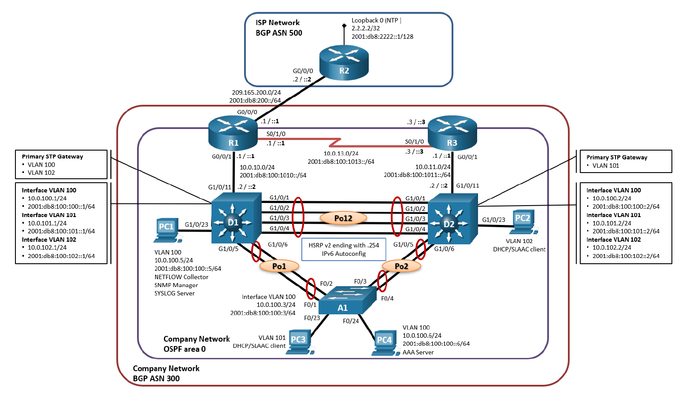
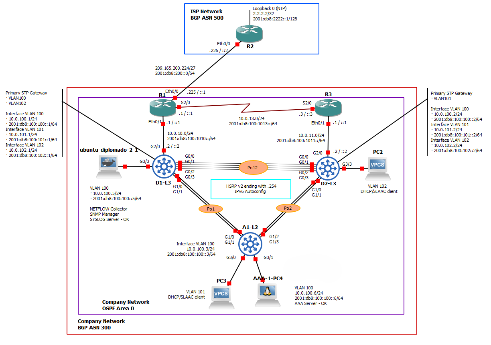

# 01 - Enterprise Network | ENCOR Scenario 1

**Autor:** Camilo Andrés Gutiérrez | Politécnico Grancolombiano
**Herramienta:** GNS3 | Cisco IOSv 15.5, IOSvL2

## Descripción
Red empresarial con enrutamiento avanzado, redundancia de primer 
salto y monitoreo centralizado. Proyecto individual.

## Tecnologías
OSPF v2/v3 · MP-BGP · HSRPv2 (IPv4/IPv6) · RADIUS AAA · 
Syslog · SNMPv2c · NetFlow v9 · LACP · RSTP · Dual-Stack

## Topologías
### Topología Planteada

### Topología Implementada

## Documentación completa
[Ver PDF](docs/ENCOR-SkillsAssessment-Scenario1.pdf)

## Configuraciones
[Ver configs](configs/)
