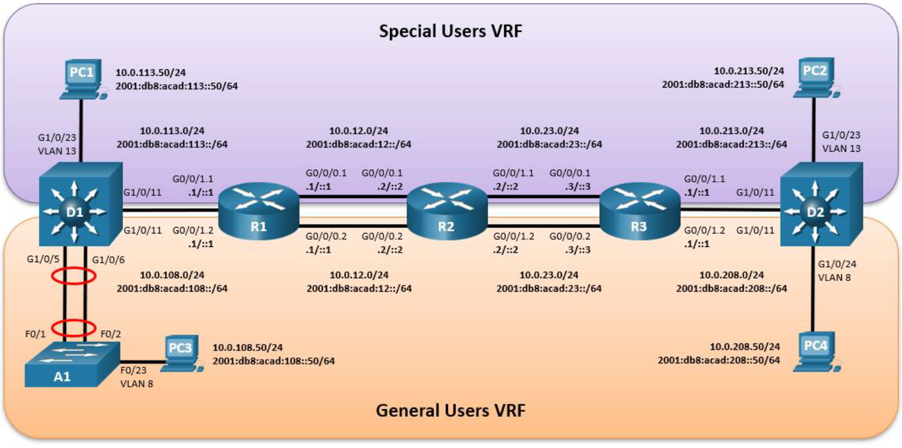
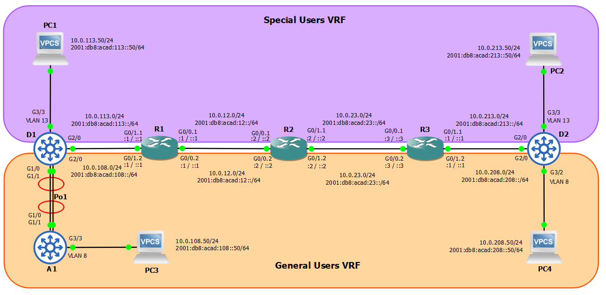

# 02 - Multi-VRF Network | ENCOR Scenario 2

**Autor:** Camilo Andrés Gutiérrez Rodríguez | Politécnico Grancolombiano

**Herramienta:** GNS3 | Cisco IOSv 15.9, IOSvL2

## Descripción
Red multi-VRF que proporciona separación lógica entre dos grupos 
de usuarios (General Users y Special Users) sobre una infraestructura 
física compartida. Proyecto individual.

## Tecnologías
VRF-Lite · Router-on-a-Stick · VLAN · 802.1Q · PAgP EtherChannel · 
RSTP · Rutas estáticas · Dual-Stack IPv4/IPv6 · AAA

## Topología
### Planteada

### Implementada

## Documentación completa
[Ver PDF](docs/PROYECTO_DIPLOMADO_2.pdf)

## Configuraciones
[Ver configs](configs/)
