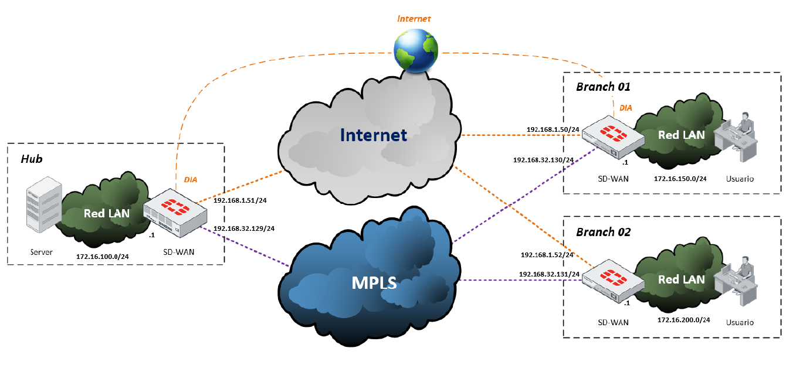

# 05 - SD-WAN Hub-and-Spoke | FortiGate

**Autor:** Camilo Andrés Gutiérrez Rodríguez | Politécnico Grancolombiano  
**Herramienta:** VMware | FortiGate VM  
**Tipo:** Proyecto individual

## Descripción
Implementación de una red SD-WAN hub-and-spoke con FortiGate 
sobre dos overlays de transporte (Internet y MPLS) con túneles 
IPsec IKEv2, enrutamiento dinámico BGP con Route Reflector, 
shortcuts ADVPN y balanceo activo-activo con failover automático.

## Tecnologías
FortiGate SD-WAN · IPsec IKEv2 · BGP iBGP Route Reflector · 
ADVPN · Performance SLA · DIA · RIA · Overlay/Underlay · 
Balanceo Activo-Activo

## Arquitectura
- **Hub:** Route Reflector BGP + Auto Discovery Sender (ADVPN)
- **Branch1 / Branch2:** Auto Discovery Receiver (ADVPN)
- **Overlays:** VPN_INTERNET (port1) · VPN_MPLS (port2)
- **BGP AS:** 65500 | Timers: keepalive 10s / holdtime 30s

## Topología

## Escenarios Validados
- ✅ Balanceo activo-activo entre overlays INET y MPLS
- ✅ Failover DIA → RIA ante caída de port1
- ✅ Shortcuts ADVPN directos entre Branches
- ✅ Convergencia sub-segundo ante fallos de enlace
- ✅ Conectividad LAN a LAN entre las tres sedes

## Documentación completa
📄 [Ver PDF](docs/SD_WAN.pdf)
