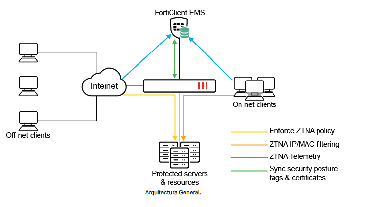
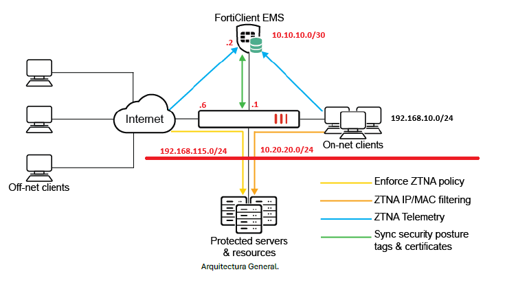

# 04 - Zero Trust Network Access (ZTNA) | Fortinet

**Autores:** Smith Cadena · Daniela Ruiz · Camilo Gutiérrez  

**Institución:** Politécnico Grancolombiano  

**Herramienta:** VMware/VirtualBox | FortiGate · FortiClient EMS

## Descripción
Implementación de un modelo de seguridad ZTNA para protección 
de infraestructuras empresariales, eliminando la confianza implícita 
bajo el principio "nunca confíes, siempre verifica".
Proyecto grupal · Mi rol: Implementación general y despliegue 
de máquinas virtuales.

## Tecnologías
FortiGate · FortiClient EMS · ZTNA Proxy · Active Directory · 
LDAP · SMB · RDP · IIS · SSL/TLS · DHCP

## Servicios Implementados
- **FortiClient EMS** - Gestión centralizada de políticas ZTNA
- **Active Directory** - Autenticación y roles de usuarios
- **DNS · RDP · SMB · IIS** - Servicios en Windows Server 2019
- **ZTNA Policies** - Control granular por postura del dispositivo

## Topología
### Planteada

### Implementada

## Documentación completa
[Ver PDF](docs/ZTNA_Fortigate.pdf)
